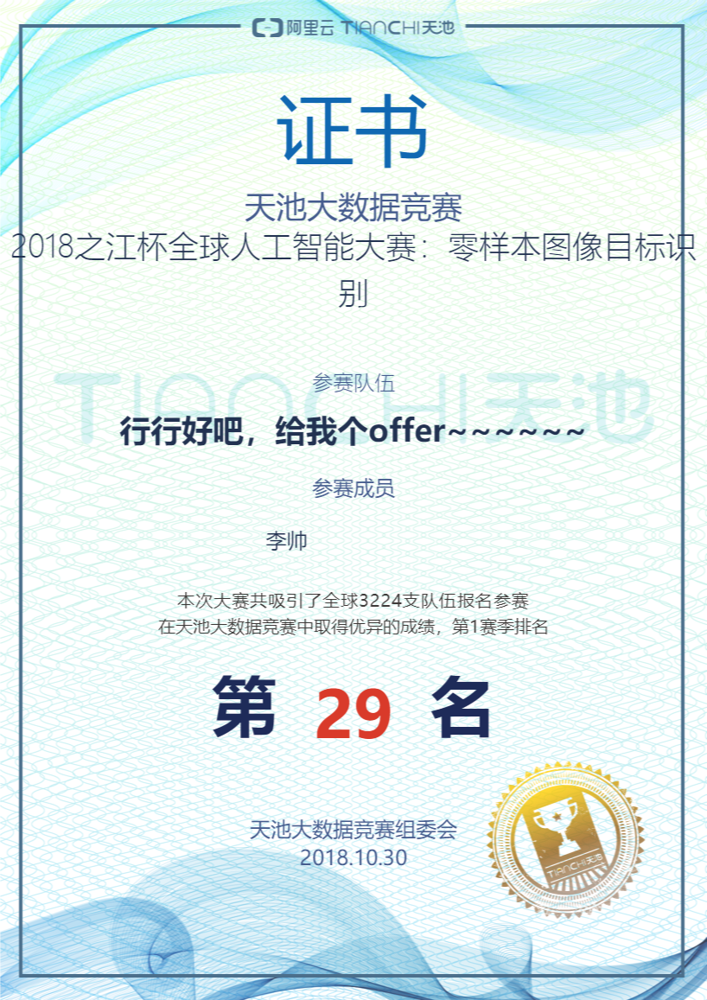
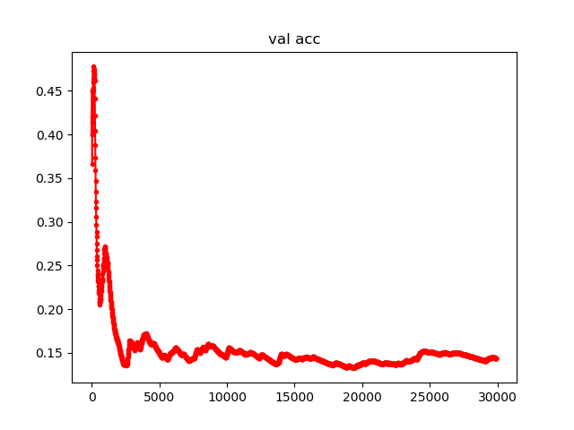

初赛结果：

验证集测试情况：

1.关于外部数据,使用了Google News语料库与Facebook 的fatstText wordCup Common
语料库,在word2vec中训练得到词向量模型.

2.requirements:

python >= 3.6

pytorch >= 0.4

torchvision

numpy

pandas

scikit-learn

tqdm

gensim

logging

keras

